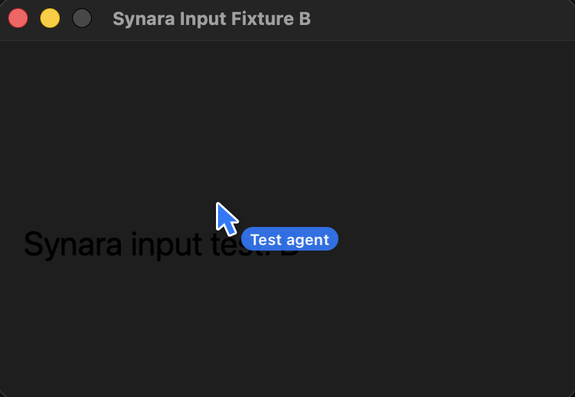
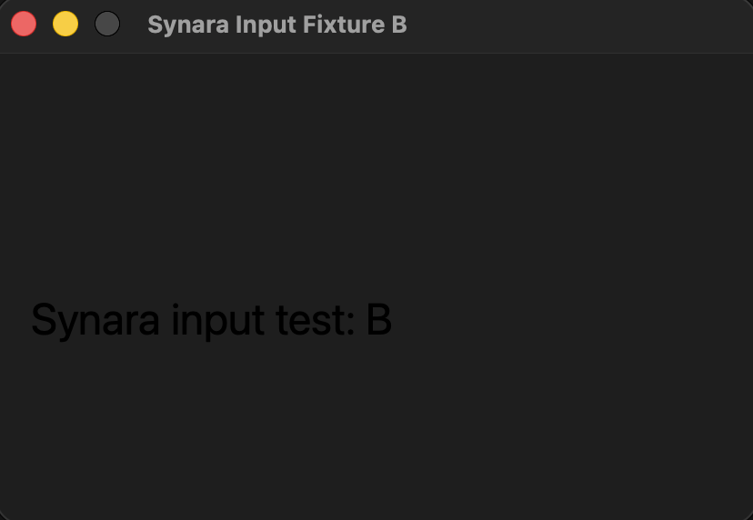

# Cursor occlusion regression

The agent targets fixture window A while the user places fixture window B above it. Both windows and all data in these captures belong to the native input test fixture.

Before, another agent move calls `orderFrontRegardless`, putting the cursor and its badge above B even though input still targets A:

After, the overlay is ordered directly above A, so B covers both A and its cursor:

`macComputerInput.integration.test.ts` independently checks WindowServer ordering before and after another agent move. It also minimizes/restores the target and checks cursor disappearance/reappearance. The regression fails on checkpoint `0a62d82b7` and passes with the fix. These are screenshots, not a recording of the interaction.
