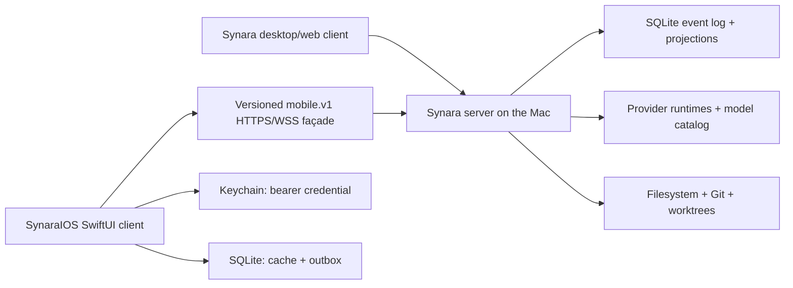

# Plan 008: Build the Synara iOS MVP as a native client of the authoritative Synara server

> **Executor instructions**: Follow this plan step by step. Run every
> verification command and confirm the expected result before moving to the
> next step. If anything in the "STOP conditions" section occurs, stop and
> report — do not improvise. When done, update the status row for this plan
> in `plans/README.md` — unless a reviewer dispatched you and told you they
> maintain the index.
>
> This is a coordinated, two-repository implementation:
>
> - Synara desktop/server:
>   `/Users/emanueledipietro/.codex/worktrees/cea8/synara`
> - Native iOS app:
>   `/Users/emanueledipietro/Developer/synara_ios`
>
> T3Code is a read-only architectural reference:
> `/Users/emanueledipietro/Developer/Testing/t3code`
>
> **Synara drift check (run first)**:
> `git diff --stat 04703ddb4c95..HEAD -- packages/contracts apps/server apps/web apps/desktop`
> and `git status --short`
>
> **iOS drift check (run first)**:
> `git -C /Users/emanueledipietro/Developer/synara_ios diff --stat 1fe1405599d7..HEAD -- CodexMobile`
> and `git -C /Users/emanueledipietro/Developer/synara_ios status --short`
>
> If an in-scope file changed since this plan was written, compare the
> "Current state" facts against the live code before proceeding. If protocol,
> auth, orchestration stream, or thread-creation semantics changed, treat the
> drift as a STOP condition and revise this plan first.

## Status

- **Priority**: P1
- **Effort**: L
- **Risk**: HIGH
- **Depends on**: none
- **Category**: direction | migration | security | reliability
- **Planned at**:
  - Synara commit `04703ddb4c95`, 2026-07-28
  - T3Code reference commit `38cfc25e5422`, 2026-07-28
  - `synara_ios` donor commit `1fe1405599d7`, 2026-07-28
- **Revision 2**, 2026-07-28: rewritten after a three-way code audit
  (Synara server, iOS donor, T3Code) against the commits above. Terminal and
  Ghostty are deferred to a dedicated post-MVP plan by operator decision;
  mobile-created worktrees are detached-HEAD only by operator decision;
  factual citations, the `synchronized`-marker design, the auth-digest
  migration scope, the connection-supervision constants, and the outbox
  concurrency model were corrected against the real code.

## Why this matters

Synara already owns the durable state and execution capabilities required by a
mobile client: projects, threads, provider/model discovery, worktrees, ordered
orchestration events, and PTYs. Reimplementing that runtime on iOS or retaining
the Remodex/Codex bridge would create two sources of truth and make reconnects,
retries, and cross-device use unreliable.

The MVP must instead make desktop and iOS two clients of the same Synara server.
The Mac remains authoritative; iOS keeps a cache, a retry outbox, credentials,
and presentation state. T3Code is the reference for this lifecycle, not a
source of UI or TypeScript runtime code.

## Product boundary and non-negotiable decisions

1. **The Mac is the execution boundary.** Provider processes, Git, worktrees,
   filesystem browsing, the orchestration event log, SQLite, and PTYs remain in
   Synara server.
2. **There is no mobile ↔ desktop database replication.** Both clients consume
   snapshots and ordered server events.
3. **`synara_ios` is a native SwiftUI app.** Do not embed the T3Code Expo app,
   Effect, or a JavaScript runtime.
4. **Do not retain a Remodex/Codex runtime path in the active iOS target.**
   During this plan, keep the donor tree intact as a reference and create a new
   `SynaraIOS` target/source root. Bulk deletion and repository cleanup are
   explicitly deferred.
5. **Keep RevenueCat as an app scaffold, isolated from Remodex production
   configuration.** Preserve the SPM dependency, launch-time configuration
   shape, subscription service, paywall/settings primitives, and
   restore/purchase flow by making Synara-owned copies in the new source root.
   Do not compile the donor payment sources unchanged and do not reuse Remodex
   product IDs, entitlement names, copy, legal URLs, icons, or API
   configuration in a production Synara build. The donor's
   `CodexMobile/BuildSupport/Base.xcconfig:7-9` contains Remodex's **live
   production RevenueCat public API key** plus entitlement `Pro` and offering
   `default`; the new target must use a new `BuildSupport/SynaraIOS.xcconfig`
   and must never set `Base.xcconfig` as its `baseConfigurationReference`.
   Because that key is committed to a repository, recommend rotating it in the
   RevenueCat dashboard (operator action, outside this plan). Monetization
   policy and gating are not part of this MVP.
6. **Do not implement Swift against Effect's internal WebSocket frame protocol.**
   Add a small, stable, language-neutral `mobile.v1` façade in Synara. It must
   delegate to existing Synara services and event streams; it must not fork
   business logic.
7. **MVP remote access is direct.** Release builds accept only HTTPS/WSS with a
   system-trusted certificate, including a Tailscale HTTPS or
   operator-configured TLS endpoint. A separate Debug configuration may allow
   private LAN HTTP/WS through narrowly scoped development ATS settings.
   Managed relay, account cloud, wake-on-demand, APNs, and continuous
   background sync are post-MVP.
8. **Foreground sync is the MVP contract.** When iOS suspends the socket, it
   reconnects, obtains a fresh snapshot, replays the gap, and returns to live.
   The UI must never imply that a sleeping or unreachable Mac is live.
9. **Terminal is post-MVP (operator decision).** `mobile.v1` revision 1 has no
   terminal methods or streams. The Ghostty renderer, the vendored
   `GhosttyKit.xcframework`, and the server-side multi-renderer ACK hardening
   are all deferred to a dedicated terminal plan (see Maintenance notes for the
   unresolved binary-provenance blocker that plan must clear first). Do not
   port, link, or touch Ghostty in this plan.
10. **Mobile-created worktrees are detached-HEAD only (operator decision).**
    iOS selects a project and a base branch/ref; the server creates the
    worktree at that ref in detached HEAD, exactly like the proven
    `creationCoordinator` semantics (`branchName` is deliberately rejected
    there today). Named-branch creation from mobile — and reconciling the web
    path, which still creates branches — is a follow-up plan, not this one.

## Target architecture

Data ownership:

| Data                                    | Authority                       | iOS storage                            |
| --------------------------------------- | ------------------------------- | -------------------------------------- |
| Environment identity and capabilities   | Synara server                   | Cached descriptor                      |
| Auth session                            | Synara auth service             | Bearer token in Keychain only          |
| Projects, threads, messages, activities | Synara projections/event log    | Replaceable SQLite projection          |
| Provider/model catalog                  | Synara provider discovery       | Short-lived cache                      |
| Worktrees and branches                  | Synara Git services             | Display state only                     |
| Outgoing turn command                   | Synara receipt after acceptance | Durable outbox until acknowledged      |
| Subscription/customer state             | RevenueCat                      | Synara-owned RevenueCat scaffold/cache |

## MVP acceptance journeys

The implementation is not complete until all of these work:

1. From Synara desktop Settings, the owner enables mobile access, creates a
   short-lived pairing QR, and sees/revokes the paired phone.
2. iOS scans the QR, verifies the environment identity, exchanges the one-time
   credential for a bearer, stores it in Keychain, and reconnects after launch.
3. iOS immediately shows a cached project/thread shell, labels it cached, then
   transitions through synchronizing to live without older snapshots replacing
   newer events.
4. A message created on desktop appears on iOS; a message sent on iOS appears
   on desktop; reconnecting does not duplicate either.
5. iOS lists server-discovered providers/models and their supported options. No
   model catalog is hard-coded in Swift.
6. iOS browses directories on the Mac, registers a project, and creates either
   a local thread or a worktree-backed thread (detached HEAD at a chosen base
   ref).
7. A worktree/thread/start-turn retry with the same operation ID returns the
   same result and does not create an orphan worktree.
8. Streaming assistant content, interrupt, approval response, and structured
   user-input response work from iOS.
9. Revoking the phone in desktop Settings closes its live connection and makes
   subsequent HTTP/WebSocket requests fail authentication.

## Current state

Facts below were re-verified against the live code at the planned commits
during the Revision 2 audit.

### Synara already has the source of truth

- `apps/server/src/config.ts:140-168` (`deriveServerPaths`) stores
  `state.sqlite`, managed worktrees, terminal logs, and a persistent
  `environment-id` under the server home.
- `apps/server/src/environment/Layers/ServerEnvironment.ts:34-88` creates the
  environment UUID once and returns a descriptor with label, platform, version,
  and capabilities. Cache and credentials must be keyed by this UUID, never by
  hostname or URL.
- `packages/contracts/src/orchestration.ts:706-863` defines full and shell
  thread projections, including provider/model selection, working directory,
  branch, worktree, latest turn, pending interaction flags, messages, activity,
  and session state. `OrchestrationShellSnapshot` is at `:874-882`; the ordered
  shell upsert/remove events and stream item are at `:883-930`.
- `packages/contracts/src/orchestration.ts:2020-2261` defines globally
  sequenced domain events (`sequence: NonNegativeInt` in the event base
  fields) plus thread snapshot/event stream items.
- `apps/server/src/wsRpc.ts:846-967` (`subscribeShell` at `:846`,
  `subscribeThread` at `:889`) uses the shared
  `makeCursorSafeSnapshotLiveStream` algorithm.
- `apps/server/src/wsSnapshotLiveStream.ts:30-72` implements
  subscribe-live-first → snapshot → high-water fence → bounded durable replay
  (`ORCHESTRATION_SNAPSHOT_REPLAY_LIMIT = 4096`, overflow forces resnapshot) →
  live-after-fence. The live handoff queue there is a 1-slot
  `Queue.bounded<OrchestrationEvent>` fed by a forked producer — a fact that
  constrains where a `synchronized` marker can be emitted (see Step 3).
- `apps/server/src/orchestration/Layers/OrchestrationEngine.ts:596-844` stores
  command receipts (fingerprint identity validation at `:601` and `:210-226`,
  accepted replay at `:607-612`) and provides idempotent orchestration
  commands.

### Synara already has native-client authentication building blocks

- `packages/contracts/src/auth.ts:13-119` supports one-time bootstrap,
  bearer-session tokens, short-lived WebSocket tickets, `mobile`/`tablet`
  metadata, active clients, and revocation.
- `apps/server/src/http.ts` exposes `/api/auth/bootstrap/bearer` (`:435`),
  `/api/auth/ws-token` (`:452`), and owner-only pairing-token issuance
  (`:457-473`, explicit `session.role !== "owner"` → 403), plus pairing-link
  and client listing/revocation routes.
- `apps/web/src/wsNativeApi.ts:575-618` already wraps pairing-link creation,
  client listing, and revocation as HTTP `requestAuthJson` calls, but Settings
  does not yet provide a complete mobile-access flow.
- `apps/server/src/auth/Layers/SessionCredentialService.ts:415-554` makes
  WebSocket tickets single-use: tickets are HMAC-signed claims
  `{v, kind, sid, jti, iat, exp}` tracked in an **in-memory**
  `outstandingWebSocketTicketsRef`; verification deletes the `jti` before use.
  Any audience carried "through" a ticket must therefore ride inside the
  signed claims (a `v: 2` bump, which invalidates in-flight browser tickets —
  acceptable one-time cost) or be re-read from the session row.
  `:579-621` revokes live sessions (`clearOutstandingWebSocketTickets` +
  `interruptConnections`).
- `apps/server/src/config.ts:43-67` refuses unsafe remote/public binding unless
  authentication and an acceptable remote-access policy are configured.
- `apps/server/src/persistence/Migrations/034_AuthAccessManagement.ts:8-24`
  currently stores short-lived pairing credentials in plaintext
  (`credential TEXT NOT NULL UNIQUE`), and `packages/contracts/src/auth.ts:73-81`
  (specifically the `credential` field at `:75`) exposes that credential again
  when active links are listed via `AuthAccessSnapshot.pairingLinks`
  (`:116-119`). Mobile access must return the raw secret once at creation and
  store/list only a hash/hint thereafter. Note: `credential` carries a UNIQUE
  constraint and is the atomic-consume lookup key in
  `apps/server/src/persistence/Layers/AuthPairingLinks.ts:59-64`
  (`UPDATE … WHERE credential = ? RETURNING`), so replacing it with a digest is
  a SQLite table rebuild plus a coordinated type change across
  `Services/AuthPairingLinks.ts` inputs/records and the `AuthPairingLink`
  contract — not a single `ALTER TABLE`.
- `apps/server/src/wsConnectionSessions.ts:19-24` carries only `owner` or
  `client` (`CurrentWsSessionRole` defaults to `"client"`), so a bearer minted
  for the phone could otherwise try the broad browser WebSocket route. A
  mobile session needs a persisted `mobile-v1` audience that the
  browser/desktop routes reject and the mobile route requires. Note the
  packaged desktop renderer connects to `ws://127.0.0.1:<port>/?token=…`
  (`apps/desktop/src/main.ts:571`) — audience enforcement must cover both the
  browser `/ws` route and that desktop root route.

### The browser protocol is not an appropriate Swift API

- `packages/contracts/src/wsCompatibility.ts:5-31` versions the current
  `/ws/bootstrap` and `/ws` protocol.
- `apps/web/src/test/effectRpcWebSocketMock.ts:31-114` shows internal Effect RPC
  frames (`Request`, `Exit`, `Chunk`, `Ack`, `Interrupt`, `Eof`, `Ping/Pong`).
- There is no generated Swift client, OpenAPI document, JSON Schema export, or
  cross-language conformance fixture for that protocol (verified: zero
  `openapi` references in `apps/`, `packages/`, `scripts/`).

The active web protocol may continue to use Effect. `mobile.v1` is an adapter
over the same services, not a rewrite and not a second state store.

### Worktree and thread creation need a mobile-safe server operation

- `apps/web/src/components/ChatView.tsx:7658-7925` currently choreographs
  worktree creation, thread creation, and turn start in the browser with manual
  rollback (`removeWorktree` → thread-meta reset at `:7900-7929`).
- `apps/server/src/agentGateway/creationCoordinator.ts` (1194 lines) already
  contains a durable exactly-once creation coordinator: reservation with a
  request fingerprint (`:127-140`, `:335-380`), replay/idempotency-conflict
  handling, worktree ownership preflight/verification (`:625`, `:726`), and
  reverse compensation (`:658-760`) including
  `deleteBranchIfUnchanged({ expectedHead })` (`:752`). Two facts matter for
  extraction:
  1. The mechanics are entangled with MCP tool result types
     (`McpToolCallResult`, `mcpToolResultJson`, `GatewayToolError`,
     `ToolInputError`), the external MCP repository, and caller-thread
     authority context. Extraction is a genuine refactor of roughly a thousand
     lines, not a lift-and-shift.
  2. `branchName` is **deliberately rejected** at `:456-462` ("no longer
     supported for managed worktrees; Synara creates a detached HEAD"), so the
     branch-compensation code is largely dormant on this path, while the web
     path still receives `result.worktree.branch`. This plan does not resolve
     that divergence; per decision 10, the mobile saga is detached-HEAD only.
- `apps/server/src/persistence/Migrations/070_AgentGatewayOperations.ts` and
  `apps/server/src/agentGateway/Layers/AgentGatewayOperationRepository.ts`
  persist that saga, but its data model is coupled to an agent caller
  thread/turn (`UNIQUE (caller_thread_id, caller_turn_id, operation_kind)`),
  which justifies a new operations table (migration 089).

The mobile API must expose one server-owned, idempotent
`workspaceThread.createAndStart` operation. Extract the reusable saga
mechanics; do not duplicate the web choreography in Swift.

### Terminal exists server-side but its client is deferred

For the record only (nothing in this plan touches it):
`packages/contracts/src/terminal.ts` defines the full terminal RPC surface and
`apps/server/src/terminal/Layers/Manager.ts` creates/reattaches live PTYs with
replayable history. Its ACK accounting is a single session-wide
`outputUnackedBytes` counter that pauses the **shared** PTY at a high
watermark and is reset by `open` (`:960`, `:1485-1525`). Making that
per-renderer — so desktop and iOS can watch the same PTY safely — is the core
of the future terminal plan, together with the Ghostty binary-provenance
blocker described in Maintenance notes.

### T3Code patterns to reproduce, not copy wholesale

Read-only reference paths at commit `38cfc25e5422` (re-verified):

- `docs/architecture/remote.md:22-111` — environment server is the execution
  boundary; desktop and mobile are clients.
- `packages/client-runtime/src/connection/supervisor.ts` — one connection
  supervisor owns retries, reachability, foreground probes, and backoff.
  Actual constants: `RETRY_DELAYS_MS = [1s, 2s, 4s, 8s, 16s]` (`:32`) with
  **no jitter** (the backoff is a deterministic table lookup);
  `CONNECTION_ESTABLISHMENT_TIMEOUT = "15 seconds"` (`:33`) bounding the
  initial connect attempt; `CONNECTION_PROBE_TIMEOUT = "15 seconds"` (`:34`)
  for the foreground health probe; `BACKOFF_RESET_AFTER_MS = 30_000` (`:35`).
  Blocked states (`ConnectionBlockedError` with
  authentication/permission/configuration reasons) stop automatic retry.
- `packages/client-runtime/src/connection/wakeups.ts:5` — wakeup taxonomy
  `"application-active" | "credentials-changed"`; a credential change under a
  live socket forces a disconnect/reconnect rather than waiting for the next
  probe to discover the failure.
- `packages/client-runtime/src/state/shell.ts:29-220` — explicit
  `empty/cached/synchronizing/live` shell states and snapshot/replay/live
  reducers; sequence gating is a plain `>` comparison, so non-contiguous
  jumps are tolerated and duplicates/stale events are ignored.
- `packages/client-runtime/src/state/threads.ts:51-311` and
  `state/threadState.ts:4` — same reducer semantics for threads, plus a fifth
  terminal status `deleted` that prevents tombstone resurrection.
- `apps/mobile/src/persistence/mobile-database.ts:225-360` — SQLite cache
  namespaced by environment.
- `apps/mobile/src/state/thread-outbox-*.ts` and
  `use-thread-outbox-drain.ts` — command IDs are persisted before send and
  retried only when connection and shell state are live. Note the actual drain
  is a **single global in-flight queue** (`dispatchingQueuedMessageIdAtom`;
  one message dispatched per pass, fully serial across the app), and
  deterministic failures are silently discarded with a `console.warn`. Step 9
  adopts the global single-flight model and deliberately improves on the
  silent discard.
- `apps/mobile/src/lib/modelOptions.ts:61-140` — model choices are derived from
  server capability data.
- `apps/mobile/src/features/projects/AddProjectScreen.tsx:591-745` — folder
  browsing is remote environment browsing, not an iOS document picker.

Do not copy T3Code's Expo/React Native UI, Effect runtime, Clerk, Cloudflare
relay, DPoP stack, PlanetScale deployment, or branding. (Caveat for readers:
T3Code's connection `errors.ts` maps relay-specific error types directly, so
its connection layer does not read cleanly without the relay context — copy
concepts, not files.)

### `synara_ios` is a donor and remains intact during server work

- The repository was cloned to
  `/Users/emanueledipietro/Developer/synara_ios` at `1fe1405599d7`.
- `CodexMobile/CodexMobile/CodexMobileApp.swift:9-41` is the current app root
  and wires RevenueCat plus Remodex/Codex state.
- `CodexMobile/CodexMobile/Services/Payments/SubscriptionService.swift`
  (`"Unlock Remodex Pro"` copy at `:53`, `codex.subscription.*` storage keys at
  `:80-81`, five-send gate at `:82,127,131`),
  `Views/Payments/RevenueCatPaywallView.swift`, and
  `Services/Payments/RevenueCatDisplayExtensions.swift` are donor references
  for the RevenueCat scaffold; the fallback `"Pro"`/`"default"`
  entitlement/offering identifiers live in
  `Services/AppEnvironment.swift:44,49`. Copy and neutralize the
  purchase/restore structure in the new source root rather than compiling
  these files unchanged.
- `CodexMobile/BuildSupport/Base.xcconfig:7-9` carries the live Remodex
  RevenueCat production key/entitlement/offering and is the donor target's
  `baseConfigurationReference` — see decision 5.
- The donor Info.plist (`BuildSupport/CodexMobile-Info.plist`) sets
  `NSAllowsArbitraryLoads = true`,
  `NSAllowsArbitraryLoadsInLocalNetworking = true`,
  `BGTaskSchedulerPermittedIdentifiers`, `NSSupportsLiveActivities`,
  `NSBonjourServices` (`_remodex-permission._tcp`), and a `phodex` URL scheme.
  None of these may be copied into the new target's plist.
- `CodexMobile/CodexMobile.xcodeproj` has Remodex bundle IDs
  (`com.emanueledipietro.Remodex` and friends), five targets (app, two test
  targets, widget, macOS menu-bar app), project-level
  `IPHONEOS_DEPLOYMENT_TARGET = 26.2` with the donor app overriding to
  `18.6`, `SWIFT_VERSION = 5.0` everywhere, and exactly **one**
  `PBXFileSystemSynchronizedRootGroup` (the donor source root, owned solely by
  the donor app target). The donor test targets are **not** synchronized —
  they use explicit per-file references. The pbxproj already contains
  hand-authored object IDs, so manual pbxproj surgery is established practice
  in this repo. RevenueCat is an SPM dependency
  (`purchases-ios-spm`, pinned 5.66.0), linked only to the donor app target.
- There is no `Package.swift` anywhere in the donor repo; `SynaraCore` will be
  the first local Swift package, with no in-repo precedent.
- `AGENTS.md`/`CLAUDE.md` (root, near-identical — keep both aligned when
  editing) prohibit running Xcode tests without explicit user permission,
  prohibit one-off report markdown files in the repo root, require redacting
  bearer-like identifiers from logs, and forbid reintroducing hosted-service
  assumptions.
- The current `origin` points at the local Remodex source clone. Never push
  Synara iOS work to that remote.

## `mobile.v1` protocol contract

Create `packages/contracts/src/mobile.ts` as the single schema source. Export
it from `packages/contracts/src/index.ts`. Because the contracts index uses
`export *` across all modules, any name collision with an existing export is a
hard TypeScript error: every exported schema/type in `mobile.ts` must carry a
`Mobile` prefix (e.g. `MobileHello`, `MobileErrorCode`).

The façade must have:

### HTTP bootstrap

- `GET /api/mobile/v1/descriptor`
  - result: environment descriptor, mobile protocol epoch/revision range,
    server instance ID, server build, and advertised mobile capabilities;
  - contains no secret and is `Cache-Control: no-store`.
- Existing `POST /api/auth/bootstrap/bearer`
  - input: one-time pairing credential;
  - output: bearer session token and expiry.
- Existing `POST /api/auth/ws-token`
  - input auth: bearer session;
  - output: single-use, short-lived WebSocket ticket.

The QR/deep-link payload is versioned and includes:

- `version`
- `baseUrl`
- `environmentId`
- `credential`
- `expiresAt`

The credential must be placed in a URL fragment or encoded QR payload that is
never sent in an HTTP query. Never log the raw QR payload, pairing credential,
bearer, or WebSocket ticket.

### WebSocket envelope

Use plain JSON with `protocol: 1`. Define tagged schemas for:

- client: `hello`, `request`, `cancel-request`, `subscribe`, `unsubscribe`,
  `pong`;
- server: `hello-accepted`, `success`, `failure`, `snapshot`, `event`,
  `synchronized`, `reset-required`, `ping`.

Every request has a UUID `requestId`; every subscription has a UUID
`subscriptionId`. Errors have stable `code`, human-readable `message`,
`retryable`, and optional `retryAfterMs`. The hello exchange binds the socket
to `environmentId`, `serverInstanceId`, client build, and negotiated revision.
`cancel-request` cancels the caller's wait. A creation saga that already owns
side effects must still reach a durable completed, failed, or compensating
state; cancellation never means "nothing happened." iOS retrieves the final
state with the same operation ID through `workspaceThread.getOperation`.

Only these mobile methods are in v1:

- `connection.probe`
- `project.create`
- `projects.listRoots`
- `projects.listDirectories`
- `provider.listProviders`
- `provider.listModels`
- `git.listBranches`
- `workspaceThread.createAndStart`
- `workspaceThread.getOperation`
- `clientTurn.start`
- `clientTurn.interrupt`
- `clientTurn.respondApproval`
- `clientTurn.respondUserInput`

Note: there is no 1:1 `NativeApi` method behind `provider.listProviders`; the
gateway synthesizes it from Synara's provider discovery/status services (the
existing surfaces are `provider.listModels` and the provider-status
subscription). That is normal façade adaptation, not logic forking.

Only these streams are in v1:

- `orchestration.shell`
- `orchestration.thread`
- `provider.statuses`

Do not expose a generic method name passthrough to all of `NativeApi`. The
allowlist is the mobile permission boundary.

Mobile filesystem inputs never accept an arbitrary absolute `cwd`. Desktop
Mobile Access settings own an allowlist of workspace roots. The API returns
opaque `rootId`, label, and display path from `projects.listRoots`;
`projects.listDirectories` and `project.create` accept `rootId` plus a
normalized relative path. The server resolves the canonical path, rejects
`..`/symlink escape, and never trusts a path reconstructed by iOS.

### Sync semantics

- Shell subscription is permanent while the app is foreground/live.
- Only the visible thread has a detail subscription in the MVP.
- Server sends an authoritative snapshot first, then matching events with a
  strictly increasing **global domain sequence**, then `synchronized`.
- A filtered shell or thread stream's domain sequence is monotonic but not
  contiguous: jumps are normal because events for other aggregates were
  filtered out. iOS ignores events at or below the applied sequence and must
  not infer loss from `lastSequence + 1`.
- Server-instance change, explicit `reset-required`, stream overflow, a
  new event with an unknown required discriminator, or decode failure ends that
  subscription and requests a resnapshot. Any event at or below the applied
  global sequence is an old/duplicate delivery and is ignored.
- Cache never overwrites a newer in-memory sequence.
- A message for an existing thread may be composed into the durable turn outbox
  while offline. New project/worktree/thread actions require a live session.
  `workspaceThread.createAndStart` is still persisted immediately before a
  live send so a lost response can be retried safely; it is not
  user-dispatched while already offline.

## Commands you will need

Do not run commands marked **permission gate** unless the operator explicitly
asks in the implementation conversation.

| Purpose                         | Command                                                                                                                                                                                                       | Expected on success                                                   |
| ------------------------------- | ------------------------------------------------------------------------------------------------------------------------------------------------------------------------------------------------------------- | --------------------------------------------------------------------- |
| Install workspace deps (Step 1) | `bun install` in the Synara worktree                                                                                                                                                                          | exit 0; `node_modules` present                                        |
| Contracts tests                 | `bun run --cwd packages/contracts test src/mobile.test.ts`                                                                                                                                                    | exit 0; mobile fixtures pass                                          |
| Server mobile tests             | `bun run --cwd apps/server test src/mobile`                                                                                                                                                                   | exit 0; auth, protocol, stream, saga tests pass                       |
| Web settings tests              | `bun run --cwd apps/web test:browser -- src/components/settings/MobileAccessSettingsPanel.browser.tsx`                                                                                                        | exit 0                                                                |
| Swift core tests                | `swift test --package-path /Users/emanueledipietro/Developer/synara_ios/CodexMobile/SynaraCore`                                                                                                               | exit 0                                                                |
| iOS compile                     | `xcodebuild -project /Users/emanueledipietro/Developer/synara_ios/CodexMobile/CodexMobile.xcodeproj -scheme SynaraIOS -destination 'generic/platform=iOS Simulator' CODE_SIGNING_ALLOWED=NO build`            | `BUILD SUCCEEDED`                                                     |
| Discover test simulator         | `xcrun simctl list devices available`                                                                                                                                                                         | at least one bootable iOS simulator and its UDID are shown            |
| Migration lineage               | `bun run migrations:check`                                                                                                                                                                                    | exit 0                                                                |
| Synara format                   | `bun fmt`                                                                                                                                                                                                     | **permission gate**; exit 0                                           |
| Synara lint                     | `bun lint`                                                                                                                                                                                                    | **permission gate**; exit 0                                           |
| Synara typecheck                | `bun typecheck`                                                                                                                                                                                               | **permission gate**; exit 0                                           |
| iOS tests                       | `xcodebuild -project /Users/emanueledipietro/Developer/synara_ios/CodexMobile/CodexMobile.xcodeproj -scheme SynaraIOS -destination 'platform=iOS Simulator,id=<UDID reported by the discovery command>' test` | **permission gate**; all `SynaraIOSTests` and `SynaraIOSUITests` pass |

Repository rules:

- Use `bun run test`, never `bun test`.
- Synara's full `fmt`, `lint`, and `typecheck` are required before final
  completion but may only run after explicit user permission.
- `synara_ios/AGENTS.md` prohibits Xcode tests without explicit user
  permission. Swift package tests are the default fast feedback loop.

## Scope

### Synara files in scope

Existing files:

- `packages/contracts/src/index.ts`
- `packages/contracts/src/auth.ts`
- `packages/contracts/src/environment.ts`
- `packages/contracts/src/orchestration.ts`
- `packages/contracts/src/ipc.ts`
- `packages/contracts/src/server.ts`
- `apps/desktop/src/main.ts`
- `apps/desktop/src/preload.ts`
- `apps/desktop/src/backendNodeOptions.ts`
- `apps/server/src/config.ts`
- `apps/server/src/effectServer.ts`
- `apps/server/src/http.ts`
- `apps/server/src/serverLayers.ts`
- `apps/server/src/wsRpc.ts`
- `apps/server/src/wsCompatibility.ts`
- `apps/server/src/wsSnapshotLiveStream.ts`
- `apps/server/src/wsSnapshotLiveStream.test.ts`
- `apps/server/src/auth/**`
- `apps/server/src/agentGateway/creationCoordinator.ts`
- `apps/server/src/agentGateway/**OperationRepository*`
- `apps/server/src/persistence/Migrations.ts`
- `apps/server/src/persistence/Services/AuthPairingLinks.ts`
- `apps/server/src/persistence/Layers/AuthPairingLinks.ts`
- `apps/server/src/persistence/Services/AuthSessions.ts`
- `apps/server/src/persistence/Layers/AuthSessions.ts`
- `apps/server/src/wsConnectionSessions.ts`
- `apps/web/src/wsNativeApi.ts`
- `apps/web/src/components/settings/AdvancedSettingsPanel.tsx`
- `apps/web/src/routes/_chat.settings.tsx`

New files:

- `packages/contracts/src/mobile.ts`
- `packages/contracts/src/mobile.test.ts`
- `packages/contracts/fixtures/mobile-v1/*.json`
- `apps/server/src/mobile/Services/MobileGateway.ts`
- `apps/server/src/mobile/Layers/MobileGateway.ts`
- `apps/server/src/mobile/Layers/MobileGateway.test.ts`
- `apps/server/src/mobile/Services/MobileWorkspaceAccess.ts`
- `apps/server/src/mobile/Layers/MobileWorkspaceAccess.ts`
- `apps/server/src/mobile/Layers/MobileWorkspaceAccess.test.ts`
- `apps/server/src/mobile/mobileWebSocketRoute.ts`
- `apps/server/src/mobile/mobileWebSocketRoute.test.ts`
- `apps/server/src/server/Services/ServerInstanceIdentity.ts`
- `apps/server/src/server/Layers/ServerInstanceIdentity.ts`
- `apps/server/src/threadCreation/Services/ThreadCreationCoordinator.ts`
- `apps/server/src/threadCreation/Layers/ThreadCreationCoordinator.ts`
- `apps/server/src/threadCreation/Layers/ThreadCreationCoordinator.test.ts`
- `apps/server/src/threadCreation/Layers/ThreadCreationOperationRepository.ts`
- `apps/server/src/threadCreation/Layers/ThreadCreationOperationRepository.test.ts`
- `apps/server/src/threadCreation/startupRecovery.ts`
- `apps/server/src/threadCreation/startupRecovery.test.ts`
- `apps/server/src/persistence/Migrations/088_MobileAuthAudienceAndPairingDigests.ts`
- `apps/server/src/persistence/Migrations/089_ThreadCreationOperations.ts`
- `apps/desktop/src/mobileAccessConfig.ts`
- `apps/desktop/src/mobileAccessConfig.test.ts`
- `apps/web/src/components/settings/MobileAccessSettingsPanel.tsx`
- `apps/web/src/components/settings/MobileAccessSettingsPanel.browser.tsx`

Migration numbers 088/089 were verified free at the planned commit (current
max is 087). If either exists after the drift check, stop and renumber through
the normal migration-lineage process (`bun run migrations:check`). Do not
silently reuse a number. Remember `Migrations.ts` is a static import registry
that must list the new migrations.

### iOS files in scope

Keep all existing donor files in place. Create:

- `CodexMobile/SynaraCore/Package.swift`
- `CodexMobile/SynaraCore/Sources/SynaraContracts/**`
- `CodexMobile/SynaraCore/Sources/SynaraTransport/**`
- `CodexMobile/SynaraCore/Sources/SynaraSync/**`
- `CodexMobile/SynaraCore/Sources/SynaraPersistence/**`
- `CodexMobile/SynaraCore/Tests/**`
- `CodexMobile/SynaraCore/Fixtures/mobile-v1/*.json`
- `CodexMobile/SynaraIOS/App/SynaraIOSApp.swift`
- `CodexMobile/SynaraIOS/App/SynaraAppGraph.swift`
- `CodexMobile/SynaraIOS/App/SynaraAppRouter.swift`
- `CodexMobile/SynaraIOS/Features/Connection/**`
- `CodexMobile/SynaraIOS/Features/Projects/**`
- `CodexMobile/SynaraIOS/Features/Threads/**`
- `CodexMobile/SynaraIOS/Features/Composer/**`
- `CodexMobile/SynaraIOS/Features/Models/**`
- `CodexMobile/SynaraIOS/Features/Subscriptions/**`
- `CodexMobile/SynaraIOS/Configuration/**`
- `CodexMobile/SynaraIOS/DesignSystem/**`
- `CodexMobile/SynaraIOS/Resources/**`
- `CodexMobile/SynaraIOSTests/**`
- `CodexMobile/SynaraIOSUITests/**`
- `CodexMobile/BuildSupport/SynaraIOS.xcconfig` (and Debug variant if needed)
- `CodexMobile/BuildSupport/SynaraIOS-Info.plist` + entitlements

Modify target membership and build settings only in:

- `CodexMobile/CodexMobile.xcodeproj/project.pbxproj`
- `CodexMobile/CodexMobile.xcodeproj/xcshareddata/xcschemes/SynaraIOS.xcscheme`
- `CodexMobile/BuildSupport/**` for the new target's Info.plist/entitlements —
  but never edit `Base.xcconfig` or the donor Info.plist themselves.

The existing donor source directory is a file-system-synchronized Xcode root.
Never add that root to the new target. Copy the small set of selected UI,
haptics, typography, and RevenueCat primitives into the separate `SynaraIOS`
synchronized root, neutralize them there, and compile only that root. Good
donor candidates (all small and low-coupling): `Services/HapticFeedback.swift`,
`Models/AppFont.swift`, `Models/AppTypographyController.swift`, and selected
`Views/Shared/` primitives. The new target must not compile `CodexService`,
Remodex/Codex RPC models, bridge, relay, SSH services, widgets, pets, voice,
or anything under `Views/Terminal/`.

### Out of scope

- Terminal on iOS, the Ghostty renderer, `GhosttyKit.xcframework`
  linking/provenance, and the server-side multi-renderer terminal ACK
  hardening (deferred to a dedicated plan — see Maintenance notes).
- Named-branch worktree creation from mobile, and reconciling the
  web-vs-coordinator branch semantics divergence.
- Bulk deletion, rename, or cleanup of the donor Remodex tree.
- Removing RevenueCat or designing monetization. Adapting a Synara-owned copy
  of the scaffold's naming/configuration while preserving purchase/restore is
  in scope.
- Final subscription tiers, entitlements, pricing, or feature gating.
- Managed cloud relay, account system, DPoP, Cloudflare tunnel provisioning.
- Mac wake, APNs, background continuous WebSocket, Live Activities.
- Full file editor, diffs, PR workflows, attachments, voice, widgets, pets,
  menu-bar target, automations, or full desktop parity.
- Running a provider or local PTY on iOS.
- SSH from iOS.
- Copying T3Code UI, branding, contracts, or deployment stack.

## Git workflow

Synara:

- Current checkout is detached. Before implementation, create
  `codex/synara-ios-server`.
- Keep protocol/server, desktop settings, and final integration as reviewable
  logical commits.
- Do not push or open a PR unless explicitly asked.

iOS:

- Before editing, rename the current local Remodex `origin` to
  `remodex-source` so an ordinary push cannot target the donor. Add a new
  `origin` only when the operator supplies or approves a Synara iOS repository
  URL; lack of a publishing remote must not block local implementation.
- Create `codex/synara-ios-mvp`.
- Never push to the Remodex source remote.
- Preserve Apache-2.0 and any applicable third-party notices for donor code
  that remains or is reused.

## Steps

### Step 1: Complete repository and environment preflight

Before source implementation:

- run `bun install` in the Synara worktree — this worktree has no
  `node_modules`, and every verification command in this plan fails with
  `ERR_MODULE_NOT_FOUND` until the install completes;
- confirm both working trees are clean and create the branches from "Git
  workflow";
- rename the iOS donor remote to `remodex-source`;
- record Release networking as system-trusted HTTPS/WSS only and Debug
  private-LAN access as a separate build configuration.

Do not alter or delete the donor source tree during this preflight. Ghostty
provenance work is explicitly **not** part of this plan (decision 9).

**Verify**:

- `bun install` exits 0 and `bun run migrations:check` runs successfully;
- `git status --short` in both repositories shows only the intentional plan or
  preflight documentation changes;
- `git -C /Users/emanueledipietro/Developer/synara_ios remote -v` shows
  `remodex-source` and no `origin` pointing at the Remodex clone.

### Step 2: Record the mobile protocol and release boundaries

Create `packages/contracts/src/mobile.ts` with:

- `MOBILE_PROTOCOL_EPOCH = 1`;
- min/max revision `1`;
- descriptor, QR payload, hello, request/response, subscription, sync marker,
  reset, and error schemas — all exported names carrying the `Mobile` prefix
  (the contracts barrel `export *`s every module; collisions are hard errors);
- exact method/stream literals from the `mobile.v1` section;
- capability literals for shell sync, thread sync, project browse, models,
  worktree creation, and interactive turns.

Create deterministic JSON fixtures in
`packages/contracts/fixtures/mobile-v1/` for:

- descriptor and pairing payload;
- hello accepted and incompatibility;
- shell snapshot/event/synchronized/reset;
- thread snapshot/event/reset-required;
- providers and models;
- local and worktree (detached-HEAD) creation;
- every workspace-thread operation polling state;
- turn start/interrupt;
- approval and user input;
- retryable and non-retryable failures.

Tests must encode with the TypeScript schema, compare against committed JSON,
and decode the fixture back. Secrets in fixtures are obvious test-only values.

**Verify**:
`bun run --cwd packages/contracts test src/mobile.test.ts`
→ all mobile contract tests pass and fixture output is stable.

### Step 3: Add authenticated mobile transport and sync foundations

First harden pairing persistence and bind credentials to an audience. This is
a coordinated schema + type change, not a single `ALTER TABLE`:

- migration `088_MobileAuthAudienceAndPairingDigests.ts` invalidates the
  normally five-minute unconsumed legacy rows, **rebuilds** the
  `auth_pairing_links` table (the plaintext `credential` column carries a
  UNIQUE constraint, so SQLite requires a table rebuild) so it stores a
  credential digest plus a short non-secret hint, and adds an audience column
  to pairing links and sessions while keeping metadata/revocation timestamps;
- update the pairing types in lockstep: `AuthPairingLinkRecord`,
  `CreateAuthPairingLinkInput`, `ConsumeAuthPairingLinkInput`, the
  digest-based lookup that replaces `getByCredential`, and the `AuthPairingLink`
  contract (raw credential removed from listings, hint added);
- generation returns the raw high-entropy credential only from the creation
  response;
- generation/consume derive an HMAC-SHA256 digest with the existing
  `ServerSecretStore` material before the atomic
  `UPDATE … WHERE credential_digest = ? RETURNING` lookup/update;
- comparisons and error behavior must not reveal whether a guessed token has a
  matching row;
- existing sessions/default browser pairing use audience `interactive`;
- the Mobile Access panel issues audience `mobile-v1`;
- bootstrap preserves the audience on the session row. WebSocket tickets are
  in-memory signed claims (`{v, kind, sid, jti, iat, exp}`), so carry the
  audience inside the signed claims and bump the claims version `v` from 1 to
  2 — this invalidates in-flight browser tickets once, which is acceptable;
  never add a second token validator;
- the browser `/ws` route **and** the desktop root WebSocket route reject
  `mobile-v1`, while `/api/mobile/v1/ws` requires `mobile-v1`.

Add the `MobileGateway` Effect service and bind only the foundation available
at this point:

- `connection.probe` with a five-second server-side timeout and no side
  effects (this timeout is a Synara choice; T3Code's foreground probe uses 15
  seconds — do not cite T3Code for the 5s value);
- environment descriptor;
- projection/snapshot queries;
- shell and thread orchestration streams.

Bind project/provider/Git/orchestration mutations only after the creation
coordinator exists. That completion is a separate later step; do not create
stubs.

Extend `apps/server/src/wsSnapshotLiveStream.ts` so the shared
subscribe-before-snapshot algorithm can expose a `synchronized` marker.
**Design constraint verified against the code**: the live handoff queue is a
1-slot `Queue.bounded<OrchestrationEvent>` fed by a forked producer — do not
try to offer a marker into that queue (wrong element type, racy position, and
the events buffered during snapshot/replay live in the upstream buffer
anyway). Instead emit the marker between the bounded durable replay and the
live-after-fence stream (e.g. `Stream.concat` of replay → marker → live). The
high-water fence guarantees every event at or below `highWaterSequence` has
already been delivered when the marker flows, which is exactly the
`synchronized` contract. Widening `SnapshotLiveStreamItem` with a third item
kind requires making **both** existing web adapters exhaustive — today
`wsRpc.ts:876-885` (shell) and `:944-965` (thread) branch if/else on `kind`
and would dereference a missing field at runtime if a third kind reached them.
Preserve the existing web stream item shape through those adapters; the mobile
gateway must not implement a second snapshot-gap-live algorithm.

Add `/api/mobile/v1/descriptor` to `apps/server/src/http.ts`.
Add `mobileWebSocketRoute` to the route merge in
`apps/server/src/effectServer.ts` (`Layer.mergeAll` at `:163-169`). Reuse:

- request-origin validation;
- `ServerAuth.authenticateWebSocketUpgrade`;
- single-use session tickets;
- authenticated connection lifetime/revocation;
- the server's existing 2 MiB WebSocket message limit
  (`MAX_WEBSOCKET_MESSAGE_BYTES`, `apps/server/src/nodeHttpServer.ts:10`).

Move the process-generation UUID currently private to
`apps/server/src/wsCompatibility.ts:18` into `ServerInstanceIdentity`. Inject
the same value into browser compatibility negotiation, the mobile descriptor,
and mobile hello validation; never generate a second "instance" UUID for
mobile.

Because native `URLSessionWebSocketTask` can set request headers, send the
single-use WebSocket ticket in the `Authorization` header for the mobile
route, not in its URL. Extend the existing auth parser narrowly if it cannot
distinguish a session bearer from a WebSocket ticket; never add a second token
validator.

The route must reject:

- ownerless/invalid/expired/reused tickets;
- a session that is not a deliberately issued `client` session;
- environment or server-instance mismatch;
- incompatible protocol revision;
- non-allowlisted method or stream;
- more than one shell or one visible-thread stream beyond the documented
  mobile budget;
- malformed frames before dispatch.

No generic `method: string` dispatch may reach `NativeApi`.

**Verify**:
`bun run --cwd apps/server test src/mobile`
→ tests prove auth, digest-at-rest with hint-only listings, ticket single use
and claims-v2 audience, negotiation, allowlist rejection, revocation, probe
timeout, shell/thread stream limits, synchronized-marker ordering after the
replay fence, exhaustive web adapter handling, and typed errors. Mutation
binding is not expected yet.

### Step 4: Add desktop Mobile Access settings and pairing

Create `MobileAccessSettingsPanel.tsx` and mount it from the Settings route.
Do not use the existing relative `requestAuthJson` calls from packaged desktop:
its renderer origin is `synara://app`, and it has an owner WebSocket identity
rather than an owner HTTP cookie.

Add owner-gated WebSocket management RPCs and `wsNativeApi.server` wrappers
for:

- create/list/revoke pairing links;
- list/revoke client sessions;
- read effective mobile-access status and approved roots.

Every handler checks `CurrentWsSessionRole === "owner"` before calling the
existing auth control plane.

For packaged desktop, add a `DesktopBridge`/IPC configuration flow:

- persist `<userData>/mobile-access.json` with mode `0600`;
- fields: enabled, mode (`trusted-proxy` or Debug-only `private-lan`), exact
  public base URL, optional private bind address, and owner-approved workspace
  roots;
- choose roots through the native folder dialog;
- on apply, gracefully restart the backend. **Note**: the existing restart
  paths (`scheduleBackendRestart` at `apps/desktop/src/main.ts:3016`,
  `restartBackendAfterCrash` at `:3191`) are crash-supervision machinery with
  give-up counters and startup-block dialogs. Add a deliberate,
  operator-initiated restart entry point that does not increment those
  counters, plus a new `IPC.*` constant in `packages/contracts/src/ipc.ts`, an
  `ipcMain.handle`, and a `preload.ts` bridge exposure;
- trusted-proxy mode keeps the plain Node HTTP backend on loopback and
  publishes only the exact system-trusted HTTPS endpoint provided by Tailscale
  Serve or an operator-managed reverse proxy;
- only Debug private-LAN mode may bind the plain backend to a non-loopback
  private interface; Release must never expose Synara's `http.createServer()`
  listener directly because `publicUrl` describes a proxy and does not add
  TLS;
- the desktop renderer's internal URL remains on `127.0.0.1` in every mode;
- pass the config file path through an explicit backend option and let
  `ServerConfig` load/canonicalize approved roots at startup; never serialize
  the root list into a public URL or process log;
- pass the exact operator-configured public URL into ServerConfig; never
  publish `0.0.0.0` as a pairing address;
- disabled startup returns to loopback-only;
- standalone server/web users get read-only status plus the equivalent CLI
  configuration guidance rather than a nonfunctional restart button.

Then use those RPC/IPC surfaces to:

- show whether the server is reachable only on loopback or has a usable
  system-trusted HTTPS/Tailscale endpoint; Debug may separately identify a
  private LAN development endpoint;
- create a labelled, short-lived `client` pairing credential with audience
  `mobile-v1`;
- build and render the versioned QR/deep link without logging it;
- show expiry and a manual copy fallback;
- list active pairing links (hint only, never the credential) and connected
  client sessions;
- revoke a pending link or paired device;
- add/remove approved workspace roots;
- explain that the Mac must be awake/reachable and that MVP sync is
  foreground.

Do not silently enable an unsafe public bind. Release QR creation stays
disabled for loopback-only, plaintext, or untrusted-certificate endpoints. A
Debug-only private LAN QR must be visibly labelled insecure development access
and must never be offered by a Release build.

**Verify**:
`bun run --cwd apps/web test:browser -- src/components/settings/MobileAccessSettingsPanel.browser.tsx`
plus focused desktop tests for `mobileAccessConfig` and backend arguments
→ packaged-owner RPC, non-owner rejection, enable/restart/disable without
tripping crash supervision, exact public URL, approved roots,
loopback-blocked, pairing-created, expired, revoke, and redaction scenarios
pass.

### Step 5: Make project/worktree/thread/start-turn one durable operation

Create a generic `ThreadCreationCoordinator`; do not add mobile branching
inside `agentGateway/creationCoordinator.ts`.

Extract or reuse these proven mechanics, decoupling them from the
AgentGateway's MCP surface as you go — the existing implementation returns
`McpToolCallResult`/`mcpToolResultJson` and fails with
`GatewayToolError`/`ToolInputError`, and it depends on the external MCP
repository and caller-thread authority context. Budget this as a real
~1000-line refactor, not a lift-and-shift; the AgentGateway tests must stay
green throughout:

- reserve operation ID with a request fingerprint;
- replay completed result for the same ID/fingerprint;
- reject ID reuse with a different fingerprint;
- persist each completed side effect;
- derive stable thread/message/command/worktree identifiers from the
  operation;
- compensate owned resources in reverse order;
- recover non-terminal operations on server startup;
- record a terminal success or failure result.

Persist operations in migration `089_ThreadCreationOperations.ts`. The input
must describe intent:

- project ID;
- local vs worktree;
- base branch/ref (worktrees are created **detached at that ref** — decision
  10; there is no new-branch field in this plan, matching the coordinator's
  existing `branchName` rejection);
- model/provider options;
- runtime and interaction modes;
- first user message;
- one client-generated `operationId`.

The mobile method is `workspaceThread.createAndStart`. Its success result
is a new concrete DTO:

- `operationId`
- `status: "completed"`
- server-derived `threadId`, `messageId`, and `commandId`
- `acceptedSequence`
- final thread shell
- worktree metadata when applicable

`workspaceThread.getOperation` returns an exact tagged union:

- `not-found` — no durable reservation exists; a transport-unknown outbox item
  may submit the same operation ID;
- `pending` — phase is `reserved`, `creating-worktree`, `creating-thread`, or
  `starting-turn`, with `updatedAt`;
- `compensating` — compensation phase and last typed error;
- `blocked` — typed reason plus owned resources requiring manual attention;
- `completed` — the full success DTO above;
- `failed` — typed terminal error plus whether compensation completed.

Add TypeScript and Swift fixtures/tests for every state. A `failed` or
`blocked` operation is never retried automatically under a new ID.

Do not accept a client `turnId`: current `thread.turn.start` does not have
one. Before side effects, validate provider/model/options authoritatively.

Wire `threadCreation/startupRecovery.ts` into server startup before mobile
command readiness:

- `reserved` resumes before side effects;
- `worktree-created` resumes only after ownership/head validation;
- `thread-created` resumes turn dispatch;
- `compensating` continues reverse cleanup;
- an ownership mismatch becomes a durable blocked/manual-attention result.

Keep the existing AgentGateway behavior passing throughout extraction. Do not
migrate the web composer in this step; schedule that as a follow-up after the
mobile path proves the generic coordinator (that follow-up is also where the
web path's named-branch semantics get reconciled).

**Verify**:

- `bun run --cwd apps/server test src/threadCreation`
- `bun run --cwd apps/server test src/agentGateway`

→ same-operation retries are identical, fingerprint conflicts fail,
disconnect-after-worktree retries do not duplicate, every injected failure
compensates owned resources, and existing AgentGateway tests remain green.

### Step 6: Complete the mobile gateway handler binding

Now bind the rest of the allowlisted `mobile.v1` methods:

- authorized workspace roots/directory browse/project create through
  `MobileWorkspaceAccess`;
- provider statuses and model discovery (synthesizing
  `provider.listProviders` from the discovery/status services);
- branch listing;
- `workspaceThread.createAndStart/getOperation`;
- existing-thread turn start, interrupt, approval, and user-input commands.

Track each request fiber by `requestId`. `cancel-request` interrupts ordinary
reads, but for creation operations it only cancels the caller wait while the
coordinator continues to a durable safe state. All stream scopes are closed
when their socket generation ends.

The server must revalidate provider, model, provider options, project,
authorized root, branch, and thread ownership on every mutation. Never trust
the catalog/cache state sent by iOS.

**Verify**:
`bun run --cwd apps/server test src/mobile`
→ every allowlisted method has positive/negative coverage; arbitrary paths,
invalid models/options, unknown methods, cancellation, operation polling, and
socket-scope cleanup are rejected or handled with the expected typed result.

### Step 7: Implement Swift contracts and golden conformance

Create the local `SynaraCore` Swift package with:

- `// swift-tools-version: 6.0` — note this puts the package targets in Swift
  6 language mode (strict concurrency) while every Xcode target in the donor
  project is `SWIFT_VERSION = 5.0`. This is intended: the package is
  greenfield actor-based code. Interop across the boundary is supported;
- platforms `.iOS(.v18)` and `.macOS(.v15)` so host `swift test` is
  supported;
- one library product `SynaraCore` containing the four targets;
- dependency graph:
  - `SynaraContracts` → no internal dependency;
  - `SynaraTransport` → `SynaraContracts`;
  - `SynaraPersistence` → `SynaraContracts`, linked to `sqlite3`;
  - `SynaraSync` → `SynaraContracts`, `SynaraTransport`,
    `SynaraPersistence`;
  - `SynaraCoreTests` → all four.

There is no existing `Package.swift` in the donor repo to model conventions
on; this package sets the precedent.

In `SynaraContracts`:

- define strongly typed IDs rather than passing raw strings everywhere;
- define Codable mobile envelope types and the exact v1 payload slice;
- include `cancel-request`, operation polling, authorized root handles, and
  connection probe;
- ignore unknown additive object fields;
- decode unknown event discriminators into an explicit `.unknown` case that
  triggers resnapshot instead of crashing or silently applying;
- preserve dates as their protocol strings at the boundary and normalize them
  in domain models;
- include the copied mobile-v1 golden fixtures.

Swift tests must decode every TypeScript fixture and encode canonical client
frames that match TypeScript expectations. Add a CI script/check that fails
when the fixture directories differ between repositories.

**Verify**:

- `swift test --package-path /Users/emanueledipietro/Developer/synara_ios/CodexMobile/SynaraCore`
- `diff -qr packages/contracts/fixtures/mobile-v1 /Users/emanueledipietro/Developer/synara_ios/CodexMobile/SynaraCore/Fixtures/mobile-v1`

→ all fixtures decode and both directories are identical.

### Step 8: Implement pairing, Keychain, transport, and connection supervision

In `SynaraTransport`, add:

- `EnvironmentProfile` keyed by stable `environmentId`, with mutable endpoint;
- QR/deep-link parser and expiry/environment validation;
- bearer bootstrap client;
- Keychain credential store plus persisted non-secret `expiresAt`;
- single-use ticket acquisition;
- `URLSessionWebSocketTask` mobile-v1 connection;
- request correlation, subscription registry, ping/pong, typed errors, and
  cancellation;
- `ConnectionSupervisor` actor as the only owner of reconnect behavior.

Transport/session states owned by the supervisor:

- `disconnected`
- `connecting`
- `connected`
- `offline`
- `blocked(reason)`
- `backoff(attempt, retryAt)`

Shell and every thread repository separately own
`empty/cached/synchronizing/live` sync state, plus a terminal `deleted`
status for threads (mirroring T3Code's `threadState.ts:4`) so tombstones
cannot resurrect. The app graph may derive a combined banner state, but a
thread resnapshot must not degrade a healthy socket or shell.

Supervision rules (T3Code-derived, with deviations labelled):

- backoff 1/2/4/8/16 seconds, deterministic table lookup with **no jitter**
  (matches T3Code exactly; a single-user server has no thundering-herd
  problem);
- reset backoff only after 30 seconds stable (T3Code
  `BACKOFF_RESET_AFTER_MS`);
- bound the **initial connection attempt** with its own 15-second
  establishment timeout, distinct from any probe (T3Code
  `CONNECTION_ESTABLISHMENT_TIMEOUT`) — a hung `URLSessionWebSocketTask`
  handshake must not stall the supervisor loop;
- do not retry while network reachability is offline;
- run the side-effect-free `connection.probe` on foreground and reconnect only
  when the probe/socket is unhealthy; the probe timeout is the server's 5
  seconds (Synara choice; T3Code uses 15);
- wakeup taxonomy has two triggers, `application-active` and
  `credentials-changed` (T3Code `wakeups.ts:5`): if the stored credential is
  deleted/replaced or a terminal auth rejection arrives while a socket is
  live, force-drop the connection immediately rather than waiting for the next
  probe to discover the 401;
- blocked auth/protocol errors do not retry indefinitely;
- every new socket obtains a new ticket;
- every socket lease has a monotonically increasing local generation; request
  completions and stream callbacks from an older generation are ignored, and
  replacement atomically cancels the previous registry;
- endpoint may change without changing environment identity;
- server-instance change invalidates stream cursors and forces snapshots;
- if the bearer is expired at launch, expires during backoff, or receives a
  terminal auth rejection, delete it from Keychain, preserve non-secret cached
  data, enter `blocked(.pairingRequired)`, and route explicitly to
  re-pairing.

**Verify**:
Swift package tests cover success, bad/expired QR, environment mismatch,
single-use ticket refresh, transient reconnect, establishment timeout,
blocked auth, foreground probe, credentials-changed force-drop, server
restart, old-socket callbacks after replacement, bearer expiration at
launch/during backoff, request cancellation, and no double supervisor.

### Step 9: Implement SQLite cache, deterministic reducers, and turn outbox

Use system SQLite through a single persistence actor; enable WAL and
migrations. Link `SynaraPersistence` with `.linkedLibrary("sqlite3")`; keep
SQL statements and row decoding inside that target. Apply
`NSFileProtectionCompleteUntilFirstUserAuthentication` and backup exclusion to
the database, WAL, and SHM files after creation and every migration. Do not
put credentials in SQLite.

Tables:

- `environments`
- `shell_cache`
- `thread_cache`
- `sync_cursors`
- `turn_outbox`

Every cache/outbox primary key includes `environmentId`. Persist:

- shell snapshot and sequence;
- one bounded set of recently opened thread snapshots and sequences;
- pending turn payload with operation kind
  (`existingThreadTurn` or `createWorkspaceThreadAndTurn`), model/provider
  options, retry state, and timestamps;
- for an existing thread: client-stable command and message IDs;
- for create-and-start: only the client-stable operation ID before acceptance;
  persist the server-derived thread/message/command IDs from the result.

Reducer rules:

- cache renders as `cached`, never `live`;
- snapshot applies only if its sequence is not older than memory;
- events apply once in strictly increasing global sequence; numeric jumps are
  valid and do not imply loss;
- events at or below the applied sequence are ignored without needing an event
  identity cache; an unknown required event above the cursor, decode failure,
  or explicit reset clears the cursor and resubscribes for a snapshot;
- tombstones/removals cannot be resurrected by older cache (`deleted` is a
  terminal thread status);
- outbox is written before optimistic UI.

Outbox drain rules:

- drains only when transport is connected and shell sync is live;
- identical command IDs are reused on retry;
- delivery is strict FIFO with **one global in-flight entry** — the
  T3Code-proven single-flight model (`dispatchingQueuedMessageIdAtom`).
  Per-thread bounded concurrency is explicitly deferred: it is plan-original
  complexity T3Code never validated, and it would need its own cross-thread
  race test matrix;
- do not start the next turn for a thread while its prior turn is
  starting/running or has unresolved approval/user-input;
- transport failure or unknown outcome retries the same ID; in-progress
  creation polls/retries the same operation; completed removes the row;
  deterministic terminal failure stops auto-drain and surfaces a blocked
  entry requiring an explicit user edit/retry with a new ID — this is a
  deliberate improvement over T3Code, which silently discards deterministic
  failures with a `console.warn`;
- compensation-pending blocks replacement.

Model the pure reducer tests on the T3Code shell/thread/outbox test cases
named in "Current state".

**Verify**:
Swift tests cover cache-first launch, stale snapshot, duplicate/non-increasing
event ignored, a legitimate domain-sequence jump, explicit reset, delete
followed by old snapshot, reconnect, server-instance change, durable outbox
relaunch, global single-flight FIFO, interactive-request gating, each retry
class, blocked-after-deterministic-failure, file-protection/backup attributes,
idempotent retry, and per-environment isolation.

### Step 10: Create the new `SynaraIOS` target without cleaning the donor tree

Inside the existing Xcode project (hand-editing `project.pbxproj` is
established practice in this repo — it already contains hand-authored object
IDs):

- add an iOS app target, unit-test target `SynaraIOSTests`, UI-test target
  `SynaraIOSUITests`, and shared scheme named `SynaraIOS` with all three
  targets wired into Build/Test actions. The new scheme must not reference any
  donor target;
- create **three** file-system-synchronized root groups — `SynaraIOS`,
  `SynaraIOSTests`, and `SynaraIOSUITests` — one per new target. Do not copy
  the donor test targets' per-file-reference pattern, and never add the donor
  `CodexMobile` synchronized root to any new target;
- create `CodexMobile/BuildSupport/SynaraIOS.xcconfig` for the new target's
  configuration. **Never set `Base.xcconfig` as the new target's
  `baseConfigurationReference`** — it injects Remodex's production RevenueCat
  key, entitlement `Pro`, and offering `default` (decision 5);
- set `IPHONEOS_DEPLOYMENT_TARGET = 18.6` explicitly for the new app and test
  targets (the project-level default is 26.2);
- set `TARGETED_DEVICE_FAMILY = 1` (iPhone-only) for the MVP, matching the
  donor;
- decide concurrency settings deliberately rather than inheriting: the donor
  app uses `SWIFT_DEFAULT_ACTOR_ISOLATION = MainActor` and
  `SWIFT_APPROACHABLE_CONCURRENCY = YES`; adopt the same for the new app
  target unless a reason emerges;
- use bundle ID `com.emanueledipietro.SynaraIOS` unless the operator supplies
  a different registered ID; `DEVELOPMENT_TEAM` is inherited from the project
  default;
- create `SynaraIOSApp`, `SynaraAppGraph`, and typed `SynaraAppRouter`;
- depend on the local `SynaraCore` package;
- link the existing RevenueCat SPM product to the new target;
- create `SynaraAppEnvironment`, `SynaraSubscriptionService`, and
  `SynaraPaywallView` as neutralized copies of the donor structure: retain
  offerings, purchase, restore, and customer-info refresh, but remove the
  five-send gate, `codex.subscription.*` storage keys, Remodex
  copy/icons/legal URLs/feature claims, and the fallback `"Pro"`/`"default"`
  identifiers (which live in the donor's `Services/AppEnvironment.swift:44,49`);
- treat the RevenueCat public key, offering, and entitlement as optional
  Synara-specific configuration in `SynaraIOS.xcconfig`/Info.plist namespace.
  Missing configuration disables the scaffold without assertion or blocking
  the MVP;
- do not gate core MVP features until Synara entitlements are explicitly
  defined;
- write a **fresh** Info.plist. Do not start from the donor plist: it sets
  `NSAllowsArbitraryLoads = true`, local-networking arbitrary loads,
  background task identifiers, Live Activities, Bonjour services, and a
  `phodex` URL scheme — none of which the MVP may carry. Add camera and
  `NSLocalNetworkUsageDescription` privacy strings;
- use separate Info.plist/ATS settings per configuration: Release permits only
  system-trusted HTTPS/WSS; Debug may opt into narrowly scoped private LAN
  HTTP/WS;
- do not add background modes that the MVP cannot honor.

Root app phases:

- onboarding/no environment;
- pairing;
- connecting/synchronizing;
- connected;
- blocked/incompatible;
- offline with cached data.

Copy selected donor design primitives into the new root and neutralize them
(`HapticFeedback`, `AppFont`/`AppTypographyController`, selected
`Views/Shared/` primitives). Do not reuse donor target membership, and do not
add `CodexService`, bridge, relay, SSH, terminal, widget, pet, voice, or
Remodex RPC files to the new target.

**Verify**:
`xcodebuild -project /Users/emanueledipietro/Developer/synara_ios/CodexMobile/CodexMobile.xcodeproj -scheme SynaraIOS -destination 'generic/platform=iOS Simulator' CODE_SIGNING_ALLOWED=NO build`
→ `BUILD SUCCEEDED`, and the new app launches to pairing/offline state without
a server. With explicit permission and a discovered simulator UDID, the
concrete test command from "Commands you will need" executes both new test
targets. Additionally grep the new target's build settings and sources to
confirm no reference to `Base.xcconfig`, the Remodex RevenueCat key, or donor
bundle IDs.

### Step 11: Build shell sync, project list, and remote folder selection

Create SwiftUI screens backed only by `SynaraCore` repositories:

- project/thread sidebar;
- explicit cached/synchronizing/live/offline indicator;
- remote folder browser;
- add-project confirmation.

The folder browser first calls `projects.listRoots`, then calls
`projects.listDirectories` with an opaque root ID and relative path. Never use
`UIDocumentPickerViewController` for selecting a Synara workspace and never
construct an absolute request path on iOS. Display the environment label and
server-provided display path so the user cannot confuse it with iPhone
storage.

Keep one foreground shell subscription. On app background, cancel the live
lease cleanly; on foreground, let `ConnectionSupervisor` restore transport and
let the shell/thread repositories independently resynchronize.

**Verify**:
package/UI tests plus a manual isolated-server smoke test show cached shell,
live replacement, desktop-created project arrival, folder browsing, project
creation, offline labeling, and foreground recovery.

### Step 12: Build provider/model selection and local/worktree task creation

Model selection:

- load `provider.listProviders`, then call `provider.listModels` for the
  selected provider/project working directory;
- refresh provider status on every socket generation and foreground,
  invalidate affected model caches from `provider.statuses`, and refresh the
  selected provider when the composer opens or its 60-second cache expires;
- show only installed/authenticated/available providers as returned by server;
- render supported reasoning effort/options from capability data;
- precedence: current draft → authoritative
  `project.defaultModelSelection` from the shell → last successful per-project
  iOS preference if it still exists in the live server catalog → first
  available server model;
- retain an existing selected model in display even if temporarily
  unavailable, but block new submission with a clear server-derived reason.

Task creation:

- choose project;
- choose local or worktree;
- for worktree, list base branches/refs and create the worktree **detached**
  at the chosen ref (decision 10 — no new-branch input exists);
- choose model/options;
- enter first prompt;
- persist one outbox operation;
- call `workspaceThread.createAndStart`;
- route to returned thread and let shell/detail streams reconcile the UI.

The iOS client describes intent only. It never runs Git or calculates a local
worktree path. Both `workspaceThread.createAndStart` and `clientTurn.start`
revalidate provider, model, and option support on the server and return typed
stale-catalog errors that trigger one refresh rather than an infinite retry.

**Verify**:
server and Swift tests cover dynamic models, unavailable model, local task,
worktree task, retry after lost response, compensation, and desktop seeing
the created task exactly once.

### Step 13: Build live thread detail, composer, and interactive requests

Maintain one detail subscription for the visible thread. Implement a pure
thread reducer for the MVP event set and resnapshot on unknown required
events.

UI must support:

- chronological user/assistant messages;
- streaming assistant updates without duplicate rows;
- running/completed/failed/interrupted state;
- activity/tool rows sufficient to understand current work;
- composer send and durable outbox;
- stop/interrupt;
- approval request and response;
- structured user-input request and response;
- model override for the next turn.

Do not wire auto-scroll to generic connection/reconnect/tool-only state.
Follow Synara's transcript guardrails: only actual transcript content should
trigger the live-output follow path.

**Verify**:
golden reducer tests and an isolated real-server smoke test prove
bidirectional desktop/iOS updates, reconnect mid-stream, no duplicate message
after outbox retry, interrupt, approval, user input, a legitimate
global-sequence jump without resnapshot, and resnapshot after injected
`reset-required`.

### Step 14: Port provider iconography (operator addition, 2026-07-28)

Bring Synara's provider icons to iOS so the provider/model pickers and thread
rows show the same iconography as desktop (Claude, Codex, Pi, OpenCode, and
the rest of `ProviderKind`).

- Source of truth: `apps/web/public/central-icons-fill/*.svg` and
  `central-icons-reversed/*.svg`, mapped per provider in
  `apps/web/src/components/ProviderIcon.tsx`. Mirror that mapping; do not
  invent new artwork or rename providers.
- Convert each provider SVG into the iOS asset catalog (template/rendered
  images or vector PDFs preserving both fill and reversed variants for
  light/dark), namespaced `provider-<kind>` in
  `CodexMobile/SynaraIOS/Resources/`.
- Add a `SynaraProviderIcon` SwiftUI component in `DesignSystem/` keyed by the
  `ProviderKind` values from `SynaraContracts`; unknown provider kinds fall
  back to a neutral glyph (never crash, mirroring the open-enumeration
  policy).
- Wire it into the provider/model selection UI (Step 12 screens) and thread
  rows (Step 11 sidebar) wherever desktop shows a provider icon.
- Verify license/attribution status of the icon set before shipping; note the
  outcome in the iOS README third-party section.
- Replace the placeholder app icon with the Synara app icon only if the
  operator supplies one; otherwise keep the placeholder and note it.

**Verify**: SynaraIOS scheme builds; a unit test asserts every `ProviderKind`
literal resolves to an existing asset or the explicit fallback; screenshots of
the model picker show correct icons in light and dark.

### Step 15: Run the end-to-end release gate and document the MVP limits

Use an isolated Synara home and non-default ports:

1. Check both ports are free **before** the dry-run (the dev runner probes
   loopback and auto-advances the offset if a port is occupied, which would
   change the expected output):
   `lsof -nP -iTCP:58090 -sTCP:LISTEN`
   and
   `lsof -nP -iTCP:8891 -sTCP:LISTEN`
   → no listener before startup.
2. Dry-run:
   `env -u SYNARA_AUTH_TOKEN SYNARA_PORT_OFFSET=3158 SYNARA_NO_BROWSER=1 bun run dev -- --home-dir ./.synara-ios-e2e --port 58090 --dry-run`
   → reports server `58090`, web `8891`, and the isolated home.
3. Start in a dedicated terminal:
   `env -u SYNARA_AUTH_TOKEN SYNARA_PORT_OFFSET=3158 SYNARA_NO_BROWSER=1 bun run dev -- --home-dir ./.synara-ios-e2e --port 58090`
4. Probe:
   `curl -sS http://127.0.0.1:58090/api/mobile/v1/descriptor`
   → valid descriptor with no credential/token.
5. Stop the dedicated dev process with its terminal interrupt after the smoke
   test; do not kill another Synara instance.

Run two distinct mobile paths:

1. **Simulator smoke**: use the loopback isolated server and a Debug-only
   dependency-injected `PairingPayloadSource` from the UI-test target. The
   fixture is held in memory, never in launch arguments/environment/logs, and
   cannot compile into Release. Validate protocol, sync, models, worktree,
   composer, and reconnect. This path does not claim camera or Local Network
   permission coverage.
2. **Physical-device gate**: after explicit permission and valid signing
   configuration, build/install on an iPhone and make the Mac reachable
   through system-trusted HTTPS/Tailscale, or the explicitly labelled Debug
   private-LAN mode. Validate real QR camera scan, Local Network permission
   granted and denied, background/foreground, device reconnect, and pairing
   revocation. Record the exact non-secret endpoint class, not tokens.

If a signed physical-device run is not authorized/available, leave those
acceptance items unverified and do not mark the plan DONE.

Test the nine acceptance journeys. Capture:

- server commit/build;
- iOS build;
- protocol revision;
- environment ID redacted to a short diagnostic prefix;
- results for reconnect, revocation, and worktree retry;
- known limitation: foreground sync with reachable, awake Mac.

Update:

- Synara user documentation for Mobile Access;
- `synara_ios` README with architecture, setup, direct-access requirements,
  RevenueCat placeholder configuration, and privacy/security behavior;
- third-party notices for code actually used.

Request explicit permission for the final heavy Synara checks and Xcode tests.
If permission is not granted, record those gates as unrun and do not mark the
plan DONE.

**Verify**:

- focused TypeScript tests from Steps 2–6 pass;
- Swift package tests pass;
- iOS simulator build succeeds;
- with explicit permission, `bun fmt`, `bun lint`, `bun typecheck`, and the
  selected Xcode tests pass;
- `git status --short` in each repository contains only intentional changes.

## Test plan

### Synara contracts/server

- Mobile envelope encode/decode and stable fixture tests.
- Auth: invalid, expired, reused, revoked, wrong environment, wrong instance,
  digest-at-rest with hint-only listings, claims-v2 audience enforcement on
  every route (browser `/ws`, desktop root, mobile).
- Protocol: revision negotiation, unknown method, malformed payload, oversized
  frame, cancellation, stream admission.
- Shell/thread: subscribe-before-snapshot race, durable replay fence,
  synchronized marker emitted after the replay fence, exhaustive adapter
  handling of the new stream item kind, legitimate non-contiguous global
  sequences, overflow reset, monotonically ordered matching output, no stale
  snapshot rollback.
- Creation saga: success local/worktree (detached), lost response replay,
  fingerprint conflict, restart recovery, compensation at every side-effect
  boundary, AgentGateway regression suite green.

### Swift core

- Decode every TypeScript golden fixture.
- QR, environment profile, Keychain abstraction, and endpoint update.
- Connection supervisor state transitions, deterministic backoff,
  establishment timeout, and credentials-changed force-drop.
- Cache migrations, environment isolation, stale snapshot protection.
- Shell/thread pure reducers, `deleted` terminal status, legitimate
  global-sequence jumps, and unknown/reset resnapshot.
- Durable outbox: global single-flight FIFO, stable IDs across
  relaunch/retry, blocked-after-deterministic-failure.

### iOS UI

- Pairing states and camera-denied fallback.
- Release rejects plaintext/untrusted endpoints; Debug handles Local Network
  permission granted/denied on a physical device.
- Cached/synchronizing/live/offline/blocked banners.
- Project/folder/model/worktree forms and server errors.
- Streaming transcript without duplicate rows or false auto-scroll.
- Approval/user-input flows.
- RevenueCat scaffold initializes only when a Synara public SDK key is
  present; missing configuration does not block development/MVP
  functionality; the new target never reads `Base.xcconfig` values.

## Done criteria

All must hold:

- [ ] Desktop and iOS consume the same authoritative Synara environment.
- [ ] No database, repository, worktree, provider runtime, or PTY is
      replicated or executed on iOS.
- [ ] `mobile.v1` is versioned, allowlisted, authenticated, fixture-tested,
      and independent of Effect's private frame format.
- [ ] Pairing uses a one-time credential; persistent bearer is Keychain-only;
      the pairing secret is hashed at rest and omitted from list responses;
      revocation terminates live access.
- [ ] A `mobile-v1` bearer/ticket cannot open the browser or desktop
      WebSocket routes, and an `interactive` session cannot open the mobile
      route.
- [ ] Shell and visible-thread sync pass cache/snapshot/replay/live reconnect
      tests without duplicates, gaps, or stale rollback.
- [ ] Global orchestration sequence jumps do not trigger false resnapshots;
      explicit reset-required and old-socket-generation callbacks are
      handled.
- [ ] Mobile project browsing is confined to owner-approved canonical roots.
- [ ] Model selection is server-authoritative.
- [ ] Local/worktree task creation is one durable idempotent server
      operation; mobile worktrees are detached-HEAD only.
- [ ] Outbox delivery is durable, global single-flight FIFO, and uses the
      documented retry/terminal-failure policy.
- [ ] The active `SynaraIOS` target does not compile Remodex/Codex bridge,
      relay, JSON-RPC, SSH, or terminal runtime code.
- [ ] The donor tree remains available; bulk cleanup was not mixed into MVP
      integration.
- [ ] RevenueCat remains linked as a Synara-configurable scaffold; the new
      target has its own xcconfig and cannot inherit Remodex production
      products/entitlements/keys.
- [ ] UI truthfully states foreground/reachable-Mac limitations.
- [ ] Release rejects plaintext/untrusted endpoints; Debug private-LAN
      behavior includes Local Network permission handling.
- [ ] Focused TypeScript tests, Swift package tests, and iOS build pass.
- [ ] After explicit permission, Synara fmt/lint/typecheck and selected Xcode
      tests pass.
- [ ] Both repositories have intentional branch/remotes and clean status after
      commits.
- [ ] `plans/README.md` marks plan 008 DONE only after all gates above.

## STOP conditions

Stop and report; do not improvise if:

- Synara auth, orchestration stream, creation coordinator, or server route
  architecture drifted from the "Current state" section.
- Migration ID `088` or `089` is already assigned.
- Implementing mobile requires exposing arbitrary `NativeApi` methods or
  bypassing the authenticated session/revocation lifecycle.
- The selected Effect schemas cannot produce deterministic mobile fixtures.
  Keep the explicit DTO façade; do not fall back to Effect frame emulation.
- A client-side worktree/Git side effect appears necessary.
- A mobile requirement appears to need named-branch worktree creation — that
  is an operator-decided scope exclusion (decision 10), not a judgment call.
- The generic thread-creation extraction changes existing AgentGateway
  semantics or cannot compensate owned worktrees after an injected failure.
- A production RevenueCat key, product ID, or entitlement must be guessed, or
  the new target would read `Base.xcconfig`.
- The current iOS remote still points to Remodex when a push is requested.
- A public non-TLS endpoint is required. Use private LAN/Tailscale development
  or configure TLS; do not normalize unsafe public plaintext.
- A requirement assumes reliable background WebSocket or a reachable sleeping
  Mac. That is a post-MVP relay/push/wake design.
- Any secret appears in logs, fixtures, screenshots, or committed config.
- A required verification fails twice after a reasonable fix.
- The user does not grant permission for mandatory final heavyweight checks;
  leave the plan IN PROGRESS with those gates named.

## Maintenance notes

- Treat the mobile protocol revision as a product API. Additive fields may
  stay within a revision; removing/renaming fields or changing semantics
  requires a revision bump and new Swift/TypeScript fixtures.
- Keep one server-side implementation of each business operation. The mobile
  gateway adapts transport only.
- After the mobile creation saga is proven, migrate the web task-creation flow
  to the same coordinator in a separate plan. That plan is also where the
  named-branch worktree semantics (web supports them, the coordinator rejects
  them) get reconciled, and where mobile may gain a new-branch option.
- **Terminal follow-up plan (deferred from this MVP)** must clear two gates
  before iOS terminal ships:
  1. **Ghostty binary provenance.** The vendored
     `CodexMobile/CodexMobile/Terminal/Vendor/GhosttyKit.xcframework` binaries
     self-identify as `1.3.2-custom-io-+91fe505e6` — a custom fork, built on
     an unidentified third party's machine, with zero provenance, build
     recipe, or license/attribution material anywhere in the donor repo
     (upstream Ghostty is MIT; the repo ships no notice). Current slice
     hashes: ios-arm64
     `f97c0e8840898b6004e1bb4bb344bcb3b17d2ae03163305d3aa6871cf20b0923`,
     ios-arm64-simulator
     `a99d4ac3c8ebd2bddda2c0147d6c722555d581f4cbf05851ba2f5382b31595cf`
     (both arm64-only). The safe path is rebuilding libghostty from a
     controlled upstream checkout with a documented recipe.
  2. **Server-side multi-renderer safety.** The terminal manager's single
     session-wide `outputUnackedBytes` counter pauses the shared PTY and is
     reset by `open`; desktop and iOS ACKing against one counter is unsafe.
     Terminal output must become generation/sequence-aware with per-renderer
     ACK state before two clients may attach.
     Also note the donor's Ghostty wrapper feeds whole-buffer diffs
     (`initialBuffer`/`lastAppliedBuffer`), so adapting it to an incremental
     sequence/ACK stream is a wrapper redesign, not a signature tweak.
- Managed relay/APNs should be a separate architecture plan. T3Code shows
  that it is an operational product, not a small extension of live sync.
- Donor cleanup, project-file renaming, widget/menu-bar decisions, and final
  branding should happen in a later focused plan after the active Synara
  target is stable.
- The committed Remodex RevenueCat production key in `Base.xcconfig` should be
  rotated in the RevenueCat dashboard (operator action).
- Reviewers should scrutinize auth redaction, reconnect ownership, sequence
  handling, worktree compensation, and accidental RevenueCat/Remodex
  production configuration.
